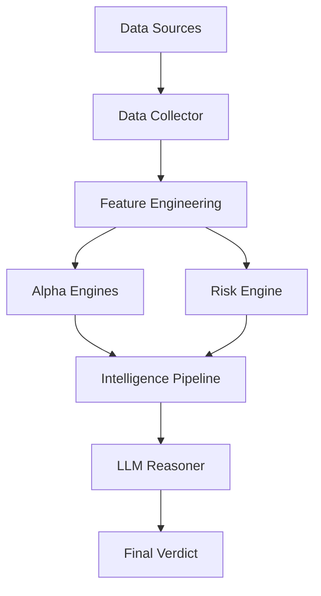

# NSE AI Market Intelligence Engine 📈🤖

An institution-grade AI-powered market analysis system designed for the Indian Stock Market (NSE/BSE). This engine combines quantitative technical analysis with Large Language Model (LLM) reasoning to provide high-probability trading verdicts, risk metrics, and position sizing.

## ✨ Features

- **Multi-Source Data Collection**: Federated data fetching from AlphaVantage and MarketStack with automatic failover.
- **Institutional Technical Indicators**: Implements Trend Strength (ADX), Volatility Regimes (ATR), Volume Analysis, and Breakout Detection.
- **Triple-Alpha Fusion**: Combines Momentum, Mean-Reversion, and Breakout strategies conditioned on market regimes.
- **LLM Cognitive Arbitration**: Uses local LLMs (via Ollama) to synthesize quantitative data into actionable reasoning.
- **Dynamic Risk Management**: Calculates precise position sizing and stop-loss levels based on real-time volatility.
- **FastAPI Backend**: High-performance asynchronous API for real-time market inference.

---

## 🏗️ Architecture



1.  **Data Collector**: Fetches OHLCV data from multiple providers.
2.  **Feature Engineering**: Calculates institutional indicators like ADX, EMA, ATR, and Volume Z-Scores.
3.  **Alpha Engines**: Evaluates market conditions using regime-specific tactical models.
4.  **LLM Reasoner**: Acts as a "Senior Analyst" to validate quantitative signals with qualitative logic.
5.  **Final Verdict**: Provides a structured BUY/SELL/HOLD decision with confidence scores and risk parameters.

---

## 🚀 Getting Started

### Prerequisites

- Python 3.9+
- [Ollama](https://ollama.com/) installed and running.
- Pull the required model:
  ```bash
  ollama pull llama3.2:3b
  ```

### Installation

1.  **Clone the repository**:
    ```bash
    git clone https://github.com/your-username/advanced-ai-stock-analysis-assistant.git
    cd advanced-ai-stock-analysis-assistant
    ```

2.  **Create a virtual environment**:
    ```bash
    python -m venv .venv
    source .venv/bin/activate  # On Windows: .venv\Scripts\activate
    ```

3.  **Install dependencies**:
    ```bash
    pip install -r requirements.txt
    ```

4.  **Set up environment variables**:
    Create a `.env` file in the root directory:
    ```env
    ALPHAVANTAGE_KEY=your_key_here
    MARKETSTACK_KEY=your_key_here
    ```

### Running the Engine

Start the FastAPI server:
```bash
uvicorn main:app --reload
```

---

## 🛠️ API Usage

### Analyze a Stock
**Endpoint**: `GET /market/analyze/{symbol}`

**Example**: `GET /market/analyze/RELIANCE`

**Response**:
```json
{
  "symbol": "RELIANCE",
  "verdict": "BUY",
  "confidence": 0.85,
  "position_size": 0.15,
  "stop_loss_pct": 2.4,
  "market_state": {
    "trend_regime": 1,
    "volatility_regime": 0,
    "accumulation": 1,
    "distribution": 0,
    "breakout": 1,
    "exhaustion": 0
  },
  "llm_reasoning": "The asset is showing strong bullish momentum..."
}
```

---

## 🧪 Tech Stack

- **Framework**: [FastAPI](https://fastapi.tiangolo.com/)
- **Data Analysis**: [Pandas](https://pandas.pydata.org/), [NumPy](https://numpy.org/)
- **Technical Indicators**: [TA-Lib (Python Wrapper)](https://github.com/bukosabino/ta)
- **AI/LLM**: [Ollama](https://ollama.com/) (Llama 3.2 3B)
- **Data Providers**: AlphaVantage, MarketStack

---

## ⚖️ Disclaimer

*This project is for educational and research purposes only. Trading stocks involves significant risk. Always consult with a certified financial advisor before making any investment decisions. The developers are not responsible for any financial losses incurred.*
